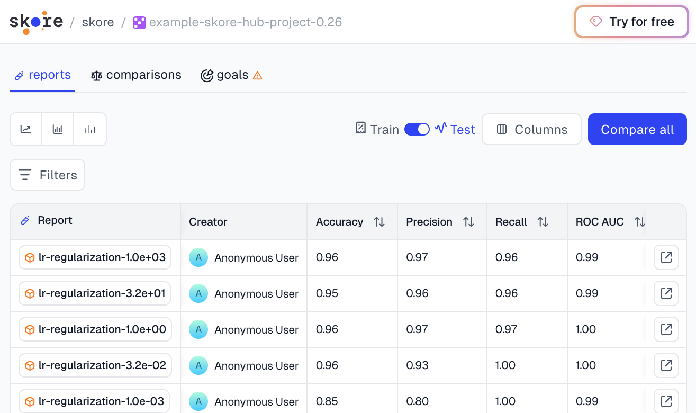
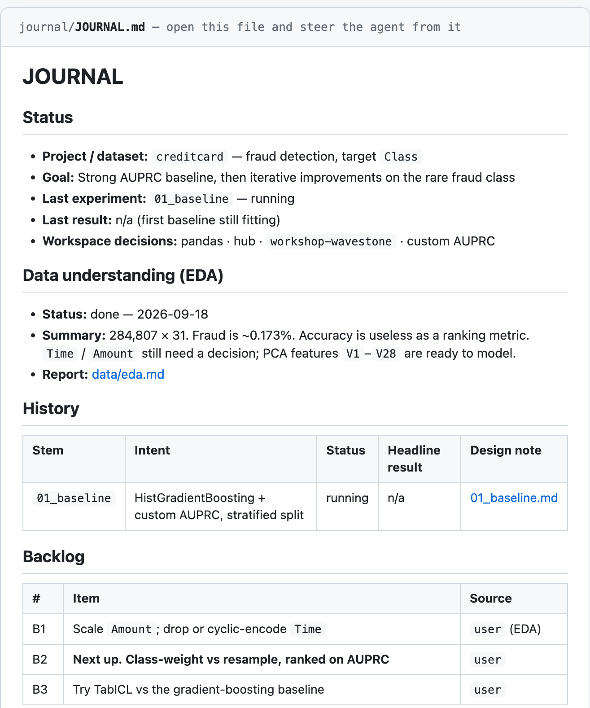

# Wavestone Workshop

Credit-card fraud detection with [skore](https://workshop.probabl.ai). 

### 1. Clone the project repository

```bash
git clone https://github.com/probabl-ai/wavestone-workshop.git
cd wavestone-workshop
```

### 2. Data

The dataset is in the repo as two zips. Join them into `data/creditcard.csv` with the python script:

```bash
python download-data
```

### 3. Claim your skore.probabl.ai account

Accept the [invitation](https://api.workshop.probabl.ai/identity/invitations/8c63c6cf-2bb1-47d9-8572-ce6d2013b98f?success_uri=https://workshop.probabl.ai/login/success).
If you already have an account, just login. If you don't, creare one. Once you clicked the invitation, you should see the **[workshop-wavestone workspace](https://workshop.probabl.ai/workshop-wavestone)** on your skore interface.

### 4. Launch the skore agent

Install `[skore-cli](https://pypi.org/project/skore-cli/)` so the `skore` command is on your `PATH`:

```bash
pip install skore-cli
```

Then install the skore agent:

```bash
skore agent --hub-url https://api.workshop.probabl.ai
```

It will ask you what workspace you want to use. Select **workshop-wavestone**.
Then it will ask you what code harness you want to use (copilot, claude-code, etc.). Select the one your prefer.

You are now ready to create your first model!

# Running the agent

Once the setup is done, start prompting the agent. It will guide you through each step: feature engineering, model choice, cross-validation, evaluation, and each subsequent iteration.

**Metric:** The ranking metric is **AUPRC** (area under the precision-recall curve). Instruct the agent to **create a custom AUPRC metric** and to use it for all evaluation and comparison. Accuracy is not a valid ranking metric here — the target class is rare (~0.173% fraud).

# Example prompts
To explore the data and run EDA:
```
Hello, I'd like to explore my data before running a baseline.
```

To start a baseline experiment:
```
Please help me setup and run a baseline experiment to predict
fraudulent transactions that I can iterate and improve on afterwards.
```

To try TabICL on your tabular problem:
```
I’d like to try TabICL on my fraud prediction dataset.
Please help me:
- Check if my data format is compatible with TabICL.
- Set up a minimal example that loads my data and runs TabICL for binary classification.
```

# What to do when the agent is running: look at the Hub

Open the [workshop-wavestone workspace](https://workshop.probabl.ai/workshop-wavestone).

While the agent is running EDA or a first baseline, browse the **pre-pushed experiments** so you can see what a Hub report looks like:

- [wavestone-cv](https://workshop.probabl.ai/workshop-wavestone) — cross-validation reports
- [wavestone-leaderboard](https://workshop.probabl.ai/workshop-wavestone) — fitted estimators scored on the held-out test set



Those two projects are the destination for your own pushes later.

# First iteration done? What's next?

After the first agent turn, a `journal/` directory appears. **Open** [journal/JOURNAL.md](journal/JOURNAL.md). This is the index the agent writes as it works: decisions recording, current status, EDA, experiment history, and the backlog of next ideas.



Read it. You can ask questions to the agent about it. Then in a new window, you can make a second model iteration, either by asking to run one of the backlog ideas, or with one of your own.

# Leaderboard

You can view the leaderboard of everyone's experiments ranked by AUPRC here: [Leaderboard](https://leaderboard.probabl.ai/d/wavestone-workshop)
Try to reach the top of the leaderboard!
